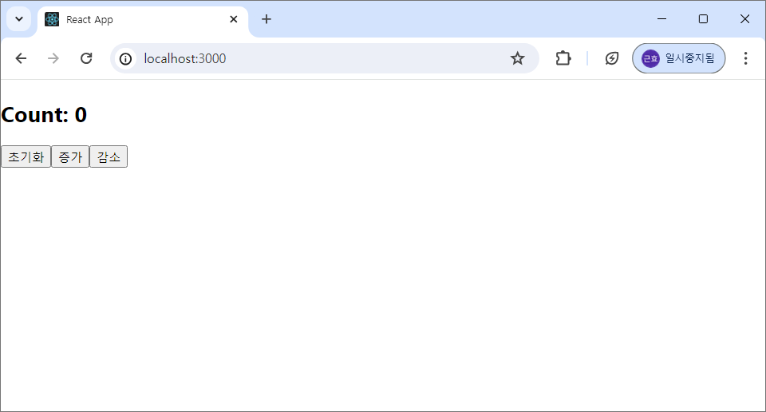
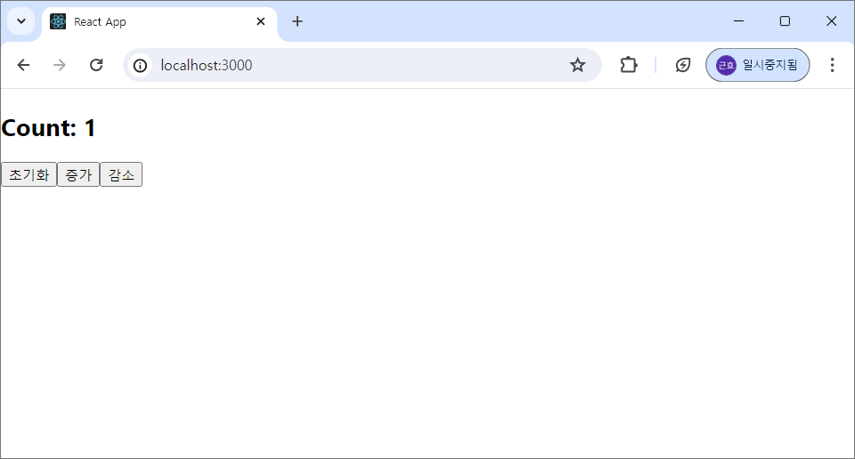
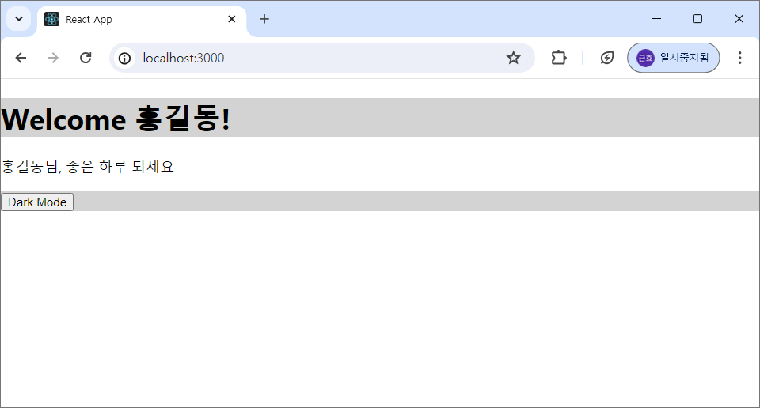
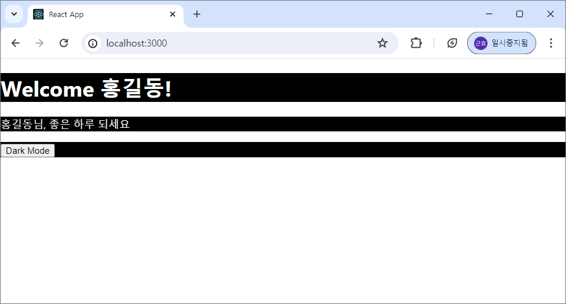
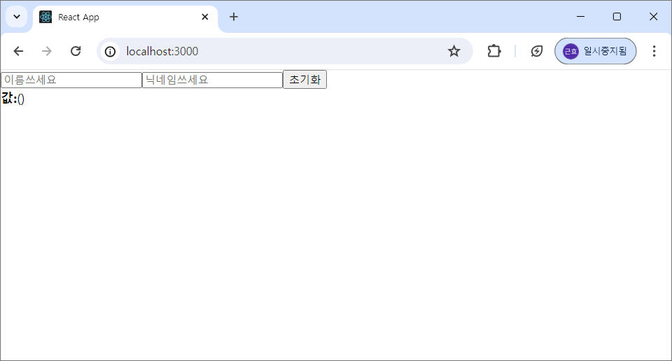
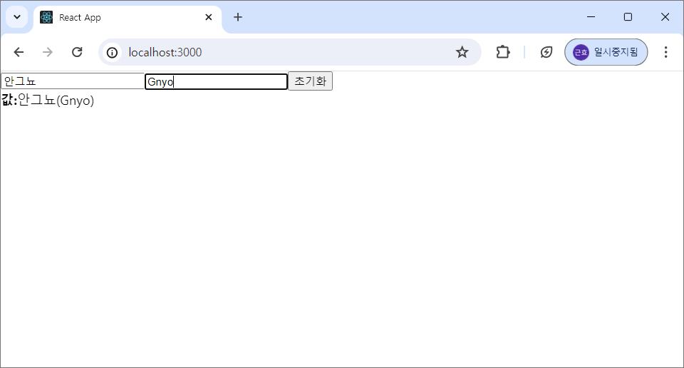
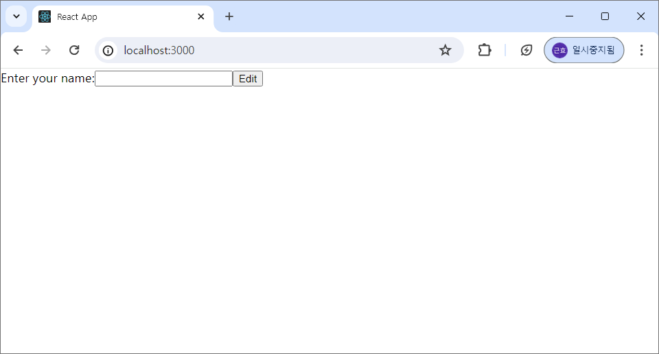
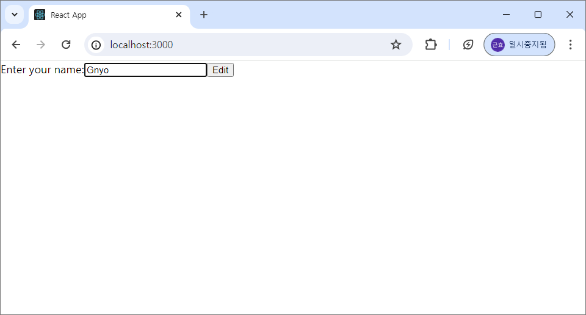
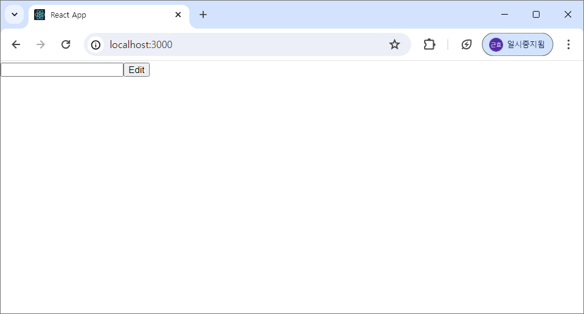
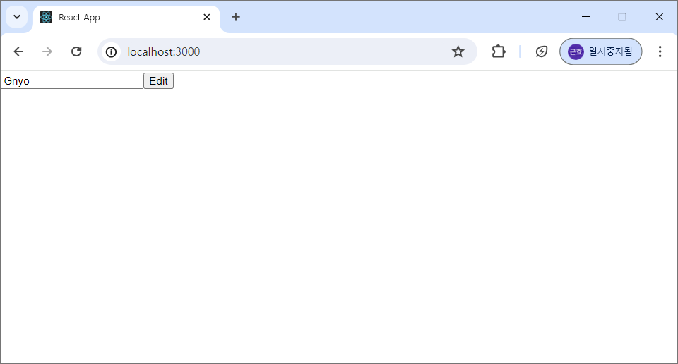

# Web Programming 07
### useReducer 실습

- Counter.js 파일을 생성하여 아래의 코드 입력
```
import React, { useState } from "react";

const Counter = ({ initialCount }) => {
    const initial = initialCount ? initialCount : 0;
    const [count, setCount] = useState(initial);
    const onIncrease = () => {
        setCount((count) => count + 1);
    };
    const onDecrease = () => {
        setCount((count) => count - 1);
    };
    return (
        <>
        <h2>Count: {count}</h2>
        <button onClick={() => setCount(initial)}>초기화</button>
        <button onClick={onIncrease}>증가</button>
        <button onClick={onDecrease}>감소</button>
        </>
    );
};
export default Counter;
```

- App.js에 아래의 코드 입력
```
import React, { useState } from "react";
import Counter from "./Counter";

const App = () => {
  return (
    <div>
      <Counter />
    </div>
  );
};
export default App;
```

- 결과

|||
---|---|---|---|
기본 상태|증가를 두 번 누른 상태|감소를 한 번 누른 상태|초기화를 누른 상태


### useContext 실습

- Header.js 파일을 생성하여 아래의 코드 입력
```
import { useContext } from "react";
import { ThemeContext } from "./ThemeContext";

const Header = () => {
    const { isDark } = useContext(ThemeContext);
    return (
        <header
        className="header"
        style={{
            backgroundColor: isDark ? "black" : "lightgray",
            color: isDark ? "white" : "black",
        }}
        >
        <h1>Welcome 홍길동!</h1>
        </header>
    );
};
export default Header;
```

- Content.js 파일을 생성하여 아래의 코드 입력
```
import React, { useContext } from "react";
import { ThemeContext } from "./ThemeContext";

const Content = () => {
    const { isDark } = useContext(ThemeContext);
    return (
        <div
        className="content"
        style={{
            backgroundColor: isDark ? "black" : "white",
            color: isDark ? "white" : "black",
        }}
        >
        <p>홍길동님, 좋은 하루 되세요 </p>
        </div>
    );
};
export default Content;
```

- Footer.js 파일을 생성하여 아래의 코드 입력
```
import React, { useContext } from "react";
import { ThemeContext } from "./ThemeContext";

const Footer = () => {
    const { isDark, setIsDark } = useContext(ThemeContext);
    const toggleTheme = () => {
        setIsDark(!isDark);
    };
    return (
        <footer
        className="footer"
        style={{ backgroundColor: isDark ? "black" : "lightgray" }}
        >
        <button className="button" onClick={toggleTheme}>
            Dark Mode
        </button>
        </footer>
    );
};
export default Footer;
```

- Page.js 파일을 생성하여 아래의 코드 입력
```
import React from "react";
import Content from "./Content";
import Header from "./Header";
import Footer from "./Footer";

const Page = () => {
    return (
        <div className="page">
        <Header />
        <Content />
        <Footer />
        </div>
    );
};
export default Page;
```

- ThemeContext.js 파일을 생성하여 아래의 코드 입력
```
import { createContext } from "react";
export const ThemeContext = createContext(null);
```

- App.js 파일에 아래의 코드 입력
```
import { useState } from "react";
import "./App.css";
import Page from "./Page";
import { ThemeContext } from "./ThemeContext";

function App() {
  const [isDark, setIsDark] = useState(false);
  return (
    <ThemeContext.Provider value={{ isDark, setIsDark }}>
      <Page />
    </ThemeContext.Provider>
  );
}
export default App;
```

- 결과

 | 
---|---|
기본 상태 | Dark Mode 버튼을 누른 상태


### useRef 실습

- InputSample.js 파일을 생성하여 아래의 코드 입력
```
import React, { useState, useRef } from "react";

const InputSample = () => {
    const [inputs, setInputs] = useState({
        이름: "",
        nickname: "",
    });
    const nameFocus = useRef();
    const { 이름, nickname } = inputs;
    const onChange = (e) => {
        const { value, name } = e.target;
        setInputs({
        ...inputs,
        [name]: value,
        });
    };
    const onReset = () => {
        setInputs({
        이름: "",
        nickname: "",
        });
        nameFocus.current.focus();
    };
    return (
        <div>
        <input
            name="이름"
            placeholder="이름쓰세요"
            onChange={onChange}
            value={이름}
            ref={nameFocus}
        />
        <input
            name="nickname"
            placeholder="닉네임쓰세요"
            onChange={onChange}
            value={nickname}
        />
        <button onClick={onReset}>초기화</button>
        <div>
            <b>값:</b>
            {이름}({nickname})
        </div>
        </div>
    );
};
export default InputSample;
```

- App.js 파일에 아래의 코드 입력
```
import React, { useState } from "react";
import InputSample from "./InputSample";

const App = () => {
  return (
    <div>
      <InputSample />
    </div>
  );
};
export default App;
```

- 결과

 | 
---| ---|
기본 상태(초기화 상태) | 값(이름, 닉네임)을 넣은 상태

### forwardRef 실습

- Form.js 파일을 생성하여 아래의 코드 입력
```
import { useRef } from "react";
import { forwardRef } from "react";

const MyInput = forwardRef(function MyInput(props, ref) {
    const { label, ...otherProps } = props;
    return (
        <label>
        {label}
        <input {...otherProps} ref={ref} />
        </label>
    );
});

function Form() {
    const ref = useRef(null);
    function handleClick() {
        ref.current.focus();
    }
    return (
        <form>
        <MyInput label="Enter your name:" ref={ref} />
        <button type="button" onClick={handleClick}>
            Edit
        </button>
        </form>
    );
}

export default Form;
```

- App.js 파일에 아래의 코드 입력
```
import React, { useState } from "react";
import Form from "./Form";

const App = () => {
  return (
    <div>
      <Form />
    </div>
  );
};
export default App;
```

- 결과

 | 
---| ---|
기본 상태 | 편집한 상태


### useImperativeHandle 실습

- MyInput.js 파일을 생성하여 아래의 코드 입력
```
import { useRef, useImperativeHandle } from 'react';

function MyInput(props, ref) {
    const inputRef = useRef(null);
    useImperativeHandle(
        ref,
        () => {
        return {
            focus() {
            inputRef.current.focus();
            },
        };
        },
        []
    );
    return <input type="text" ref={inputRef} />;
}
export default MyInput;
```

- InputForm.js 파일을 생성하여 아래의 코드 입력
```
import { useRef,forwardRef } from 'react';
import MyInput from './MyInput';
const ForwardedMyInput = forwardRef(MyInput);
function InputForm() {
    const ref = useRef(null);
    function handleClick() {
        ref.current.focus();
    }
    return (
        <form>
        <ForwardedMyInput ref={ref} />
        <button type="button" onClick={handleClick}>
            Edit
        </button>
        </form>
    );
}
export default InputForm;
```

- 결과

 | 
---| ---|
기본 상태 | 편집한 상태


### useEffect

- UseEffectTest.js 파일을 생성하여 아래의 코드 입력
```
import { useEffect, useState } from "react";

export default function UseEffectTest() {
    const [count, setCount] = useState(1000);

    useEffect(() => {
        console.log("useEffect");
        const interval = setInterval(() => console.log(count), count);
        return () => {
        clearInterval(interval);
        console.log("clearInterval");
        };
    }, [count]);
    const countHandler = (e) => {
        setCount((c) => c + 1000);
    };

    return (
        <div className="App">
        <h1>{count}</h1>
        <button onClick={countHandler}>카운트 증가</button>
        </div>
    );
}
```

- App.js 파일에 아래의 코드 입력
```
import React, { useState } from "react";
import UseEffectTest from "./UseEffectTest";

const App = () => {
  return (
    <div>
      <UseEffectTest />
    </div>
  );
};
export default App;
```

- 결과

 |  | 
---| ---| ---|
기본 상태 | 카운트 증가 버튼을 한 번 누른 상태 | 카운트 증가 버튼을 네 번 누른 상태

---
---
---

# Web Programming 07-1
### useMemo 실습

- Practice.js 파일을 생성하여 아래의 코드 입력
```
import { useEffect, useState } from "react";

export default function Practice() {
  const [number, setNumber] = useState(0);
  const [isKorea, setIsKorea] = useState(true);
  // string 할당
  // const location = isKorea ? "한국" : "외국";

  // 📌Object 할당
  const location = {
    country: isKorea ? "한국" : "외국",
  };

  useEffect(() => {
    console.log("useEffect 호출");
  }, [location]);
  
  return (
    <div>
      <h2>하루에 몇끼 먹어요?</h2>
      <input
        type="number"
        value={number}
        onChange={(e) => setNumber(e.target.value)}
      />
      <hr />
      <h2>어느 나라에 있어요?</h2>
      {/* 📌 location.country 할당 */}
      <p>나라:{location.country}</p>
      <button onClick={() => setIsKorea(!isKorea)}>비행기 타자</button>
      <p></p>
    </div>
  );
}
```

※ 아래의 코드를 사용하면 'location' 개체가 모든 렌더에서 useEffect Hook(17행)의 종속성을 변경함
```
const location = useMemo(() => {
    return { country: isKorea ? "한국" : "외국" };
}, [isKorea]);
```

- App.js에서 아래의 코드 입력
```
import React, { useState } from "react";
import Practice from "./Practice";
const App = () => {
  return (
    <div>
      <Practice />
    </div>
  );
};
export default App;
```

- 결과


### useCallback 실습

- App.js에서 아래의 코드 입력
```
import React, { useState } from "react";
import SmartHome from "./SmartHome";
const App = () => {
  return (
    <div style={{ position: "absolute", top: "50%", left: "50%" }}>
      <SmartHome />
    </div>
  );
};
export default App;
```

- Light.js 파일을 생성하여 아래의 코드 입력
```
import React from "react";

function Light({ room, on, toggle }) {
  console.log({ room, on });
  return (
    <div>
      <button onClick={toggle}>
        {room}
        {on ? "💡" : "⬛"}
      </button>
    </div>
  );
}
export default Light;
```

- SmartHome.js 파일을 생성하여 아래의 코드 입력
```
import React, { useState } from "react";
import Light from "./Light";

function SmartHome() {
  const [masterOn, setMasterOn] = useState(false);
  const [kitchenOn, setKitchenOn] = useState(false);
  const [bathOn, setBathOn] = useState(false);
  const toggleMaster = () => {
    setMasterOn(!masterOn);
  };
  const toggleKitchen = () => {
    setKitchenOn(!kitchenOn);
  };
  const toggleBath = () => {
    setBathOn(!bathOn);
  };
  return (
    <div>
      <Light room="침실" on={masterOn} toggle={toggleMaster}></Light>
      <Light room="주방" on={kitchenOn} toggle={toggleKitchen}></Light>
      <Light room="욕실" on={bathOn} toggle={toggleBath}></Light>
    </div>
  );
}
export default SmartHome;
```

- 결과 

 | 
---|---|
꺼진 상태 | on된 상태


### useTransition 실습

- Home.js 파일을 생성하여 아래의 코드 입력
```
import { useDeferredValue, useState } from "react";

export default function Home() {
  const [count1, setCount1] = useState(0);
  const [count2, setCount2] = useState(0);
  const [count3, setCount3] = useState(0);
  const [count4, setCount4] = useState(0);
  const deferredValue = useDeferredValue(count2);
  const onIncrease = () => {
    setCount1(count1 + 1);
    setCount2(count2 + 1);
    setCount3(count3 + 1);
    setCount4(count4 + 1);
  };
  console.log({ count1 });
  console.log({ count2 });
  console.log({ count3 });
  console.log({ count4 });
  console.log({ deferredValue });
  
  return <button onClick={onIncrease}>클릭</button>;
}
```

- App.js에서 아래의 코드 입력
```
import React, { useState } from "react";

import Home from "./Home";
const App = () => {
  return (
    <div>
      <Home />
    </div>
  );
};
export default App;
```

- 결과

 |  | 
---| ---| ---|
기본 상태 | 버튼을 한 번 누른 상태 | 버튼을 두 번 누른 상태


### useID 실습

- PasswordField.js 파일 생성 후 아래 코드 입력
```
import { useId } from "react";

function PasswordField() {
  const passwordHintId = useId();
  return (
    <>
      <label>
        Password:
        <input type="password" aria-describedby={passwordHintId} />
      </label>
      <p id={passwordHintId}>
        The password should contain at least 18 characters
      </p>
    </>
  );
}
export default PasswordField;
```

- App.js에 아래 코드 입력
```
import React, { useState } from "react";
import PasswordField from "./PasswordField";

const App = () => {
  return (
    <div>
      <PasswordField/>
    </div>
  );
};
export default App;
```

-결과

 | 
---| ---|
기본 상태 | 패스워드(비밀번호)를 입력한 상태


### Custom Hook
- Hook은 개발자가 직접 작성하여 새로운 Hook을 생성할 수도 있는데, 이를 Custom Hook이라고 함
- 조건문, 반복문 등에서 호출될 수 없고 컴포넌트 최상단에서만 호출 가능
- React 컴포넌트 함수 내에서만 호출 되어야 함
- 함수 이름의 접두어는 반드시 ‘use’ 로 지정해야 함