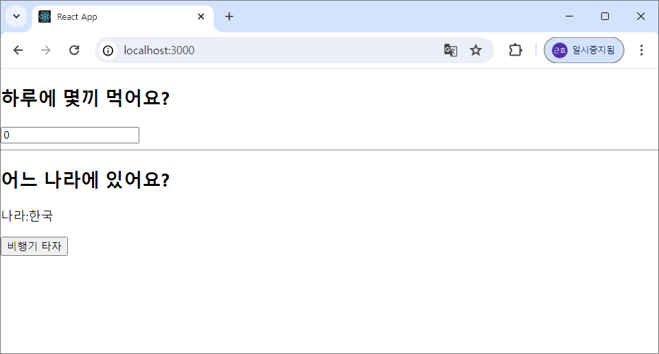
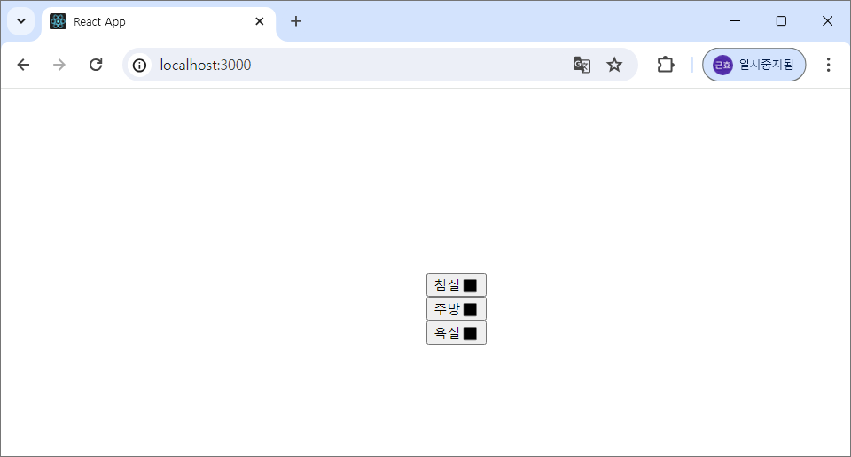
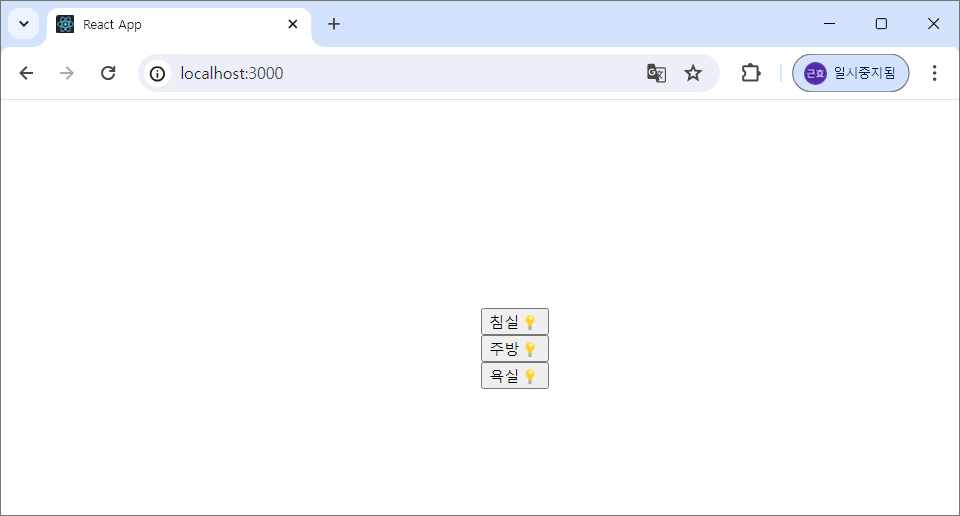
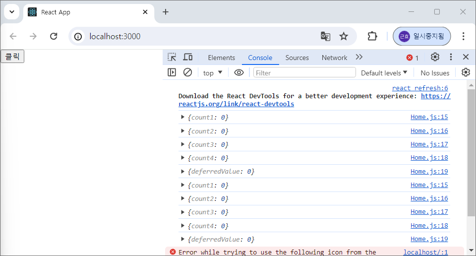
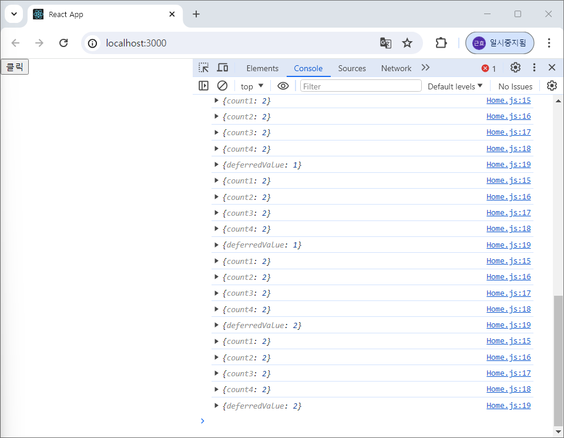
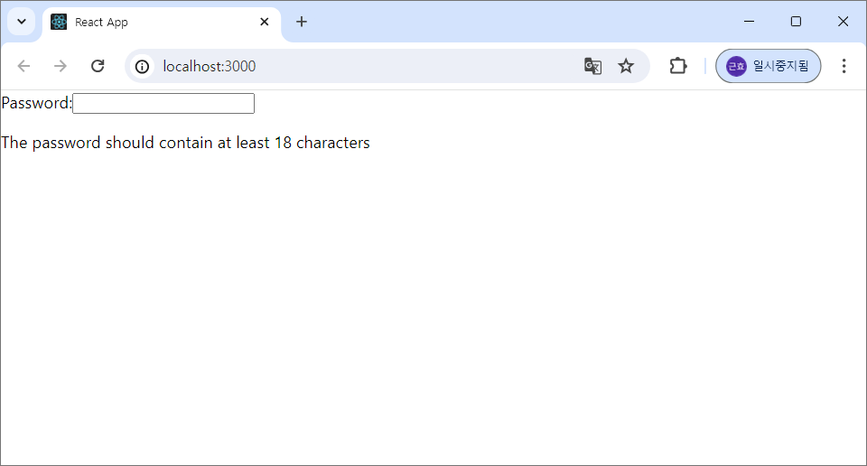
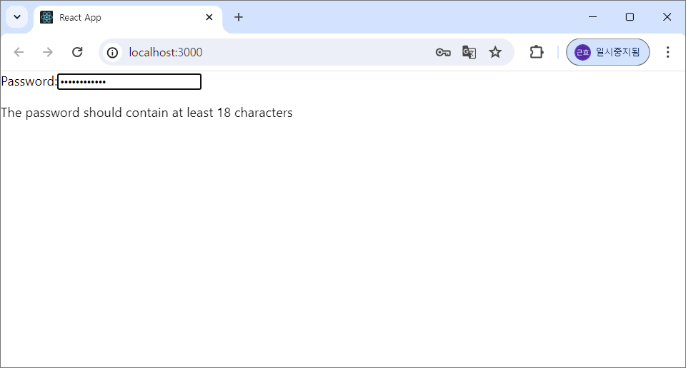

### useMemo 실습

- Practice.js 파일을 생성하여 아래의 코드 입력
```
import { useEffect, useState } from "react";

export default function Practice() {
  const [number, setNumber] = useState(0);
  const [isKorea, setIsKorea] = useState(true);
  // string 할당
  // const location = isKorea ? "한국" : "외국";

  // 📌Object 할당
  const location = {
    country: isKorea ? "한국" : "외국",
  };

  useEffect(() => {
    console.log("useEffect 호출");
  }, [location]);
  
  return (
    <div>
      <h2>하루에 몇끼 먹어요?</h2>
      <input
        type="number"
        value={number}
        onChange={(e) => setNumber(e.target.value)}
      />
      <hr />
      <h2>어느 나라에 있어요?</h2>
      {/* 📌 location.country 할당 */}
      <p>나라:{location.country}</p>
      <button onClick={() => setIsKorea(!isKorea)}>비행기 타자</button>
      <p></p>
    </div>
  );
}
```

※ 아래의 코드를 사용하면 'location' 개체가 모든 렌더에서 useEffect Hook(17행)의 종속성을 변경함
```
const location = useMemo(() => {
    return { country: isKorea ? "한국" : "외국" };
}, [isKorea]);
```

- App.js에서 아래의 코드 입력
```
import React, { useState } from "react";
import Practice from "./Practice";
const App = () => {
  return (
    <div>
      <Practice />
    </div>
  );
};
export default App;
```

- 결과




### useCallback 실습

- App.js에서 아래의 코드 입력
```
import React, { useState } from "react";
import SmartHome from "./SmartHome";
const App = () => {
  return (
    <div style={{ position: "absolute", top: "50%", left: "50%" }}>
      <SmartHome />
    </div>
  );
};
export default App;
```

- Light.js 파일을 생성하여 아래의 코드 입력
```
import React from "react";

function Light({ room, on, toggle }) {
  console.log({ room, on });
  return (
    <div>
      <button onClick={toggle}>
        {room}
        {on ? "💡" : "⬛"}
      </button>
    </div>
  );
}
export default Light;
```

- SmartHome.js 파일을 생성하여 아래의 코드 입력
```
import React, { useState } from "react";
import Light from "./Light";

function SmartHome() {
  const [masterOn, setMasterOn] = useState(false);
  const [kitchenOn, setKitchenOn] = useState(false);
  const [bathOn, setBathOn] = useState(false);
  const toggleMaster = () => {
    setMasterOn(!masterOn);
  };
  const toggleKitchen = () => {
    setKitchenOn(!kitchenOn);
  };
  const toggleBath = () => {
    setBathOn(!bathOn);
  };
  return (
    <div>
      <Light room="침실" on={masterOn} toggle={toggleMaster}></Light>
      <Light room="주방" on={kitchenOn} toggle={toggleKitchen}></Light>
      <Light room="욕실" on={bathOn} toggle={toggleBath}></Light>
    </div>
  );
}
export default SmartHome;
```

- 결과 

 | 
---|---|
꺼진 상태 | on된 상태


### useTransition 실습

- Home.js 파일을 생성하여 아래의 코드 입력
```
import { useDeferredValue, useState } from "react";

export default function Home() {
  const [count1, setCount1] = useState(0);
  const [count2, setCount2] = useState(0);
  const [count3, setCount3] = useState(0);
  const [count4, setCount4] = useState(0);
  const deferredValue = useDeferredValue(count2);
  const onIncrease = () => {
    setCount1(count1 + 1);
    setCount2(count2 + 1);
    setCount3(count3 + 1);
    setCount4(count4 + 1);
  };
  console.log({ count1 });
  console.log({ count2 });
  console.log({ count3 });
  console.log({ count4 });
  console.log({ deferredValue });
  
  return <button onClick={onIncrease}>클릭</button>;
}
```

- App.js에서 아래의 코드 입력
```
import React, { useState } from "react";

import Home from "./Home";
const App = () => {
  return (
    <div>
      <Home />
    </div>
  );
};
export default App;
```

- 결과

 |  | 
---| ---| ---|
기본 상태 | 버튼을 한 번 누른 상태 | 버튼을 두 번 누른 상태


### useID 실습

- PasswordField.js 파일 생성 후 아래 코드 입력
```
import { useId } from "react";

function PasswordField() {
  const passwordHintId = useId();
  return (
    <>
      <label>
        Password:
        <input type="password" aria-describedby={passwordHintId} />
      </label>
      <p id={passwordHintId}>
        The password should contain at least 18 characters
      </p>
    </>
  );
}ㄴ
export default PasswordField;
```

- App.js에 아래 코드 입력
```
import React, { useState } from "react";
import PasswordField from "./PasswordField";

const App = () => {
  return (
    <div>
      <PasswordField/>
    </div>
  );
};
export default App;
```

-결과

 | 
---| ---|
기본 상태 | 패스워드(비밀번호)를 입력한 상태


### Custom Hook
- Hook은 개발자가 직접 작성하여 새로운 Hook을 생성할 수도 있는데, 이를 Custom Hook이라고 함
- 조건문, 반복문 등에서 호출될 수 없고 컴포넌트 최상단에서만 호출 가능
- React 컴포넌트 함수 내에서만 호출 되어야 함
- 함수 이름의 접두어는 반드시 ‘use’ 로 지정해야 함